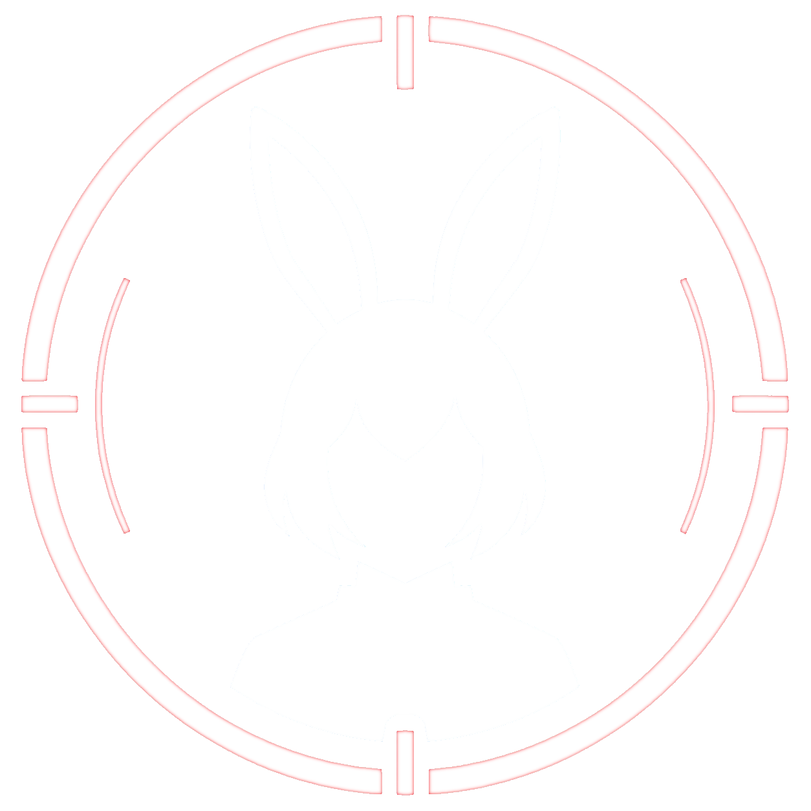

<p align="center">
  
</p>

# U.N. Avatar

U.N. Avatar は VRM(0/1) と VRC / Unity アバターを、配信向けに軽快に表示する仮想アバターレンダラーです。U.N. Motion や VMC 対応アプリから姿勢・表情・手指を受け取り、透過ウィンドウ、Spout2、スクリーンショットなどで出力できます。

v2 では従来の `.vrm` / MToon / SpringBone 対応に加えて、VRC / Unity アバター、lilToon / PhysBone、Modular Avatar ベースの Wardrobe を扱えます。VRC / Unity アバターは Unity Editor に追加する U.N. Avatar Exporter で `.unavatar` にエクスポートしてから使います。

## はじめて使う場合

1. `un-avatar-supervisor.exe` を起動します。
2. 左側メニューの `プロファイル` を開き、`+` ボタンで新しいプロファイルを作ります。
3. アバターファイルとして `.vrm` または `.unavatar` を選びます。
4. 必要な設定を行い、`起動` ボタンで Renderer を起動します。
5. U.N. Motion や VMC 対応アプリから UNMF/Z または VMC/UDP でモーションを送ります。

VRC / Unity アバターを使う場合は、先に U.N. Avatar Exporter で `.unavatar` を作ります。`.unavatar` は、VRC / Unity アバターを U.N. Avatar で使うための配信用アバターパッケージです。Exporter の導入、`1. Base -> 2. Wardrobe Sets -> 3. Export` の操作、Wardrobe の作り方は [v2 Getting Started](docs/v2-getting-started.md) を参照してください。

最初は Supervisor でプロファイルを作成・調整します。設定が固まったら、ショートカットやピン留めから特定プロファイルの Renderer を直接起動できます。Renderer 単独起動中の Wardrobe、出力、ウィンドウ、カメラなどの操作は、Windows タスクトレイの Renderer アイコンを右クリックして行います。

## U.N. Avatar Exporter を VCC に追加する

VCC の custom repository として追加すると、Unity project の Package Manager から `U.N. Avatar Unity Exporter` を導入できます。

- [公式 Web の Add to VCC](https://usagi.github.io/un-avatar/) を使う
- または VCC の `Settings > Packages > Add Repository` に次の URL を追加する

```text
https://usagi.github.io/un-avatar/vcc/index.json
```

## できること

- VRM / glTF / `.unavatar` ベースのアバターを wgpu renderer (Vulkan / DX12) で描画。
- Supervisor Console で複数のプロファイルと Renderer を管理。
- VRC / Unity アバターを `.unavatar` に変換し、Unity なしの Renderer runtime で利用。
- UNMF/Z と VMC/UDP のモーション入力を受け取り、姿勢、表情、手指、UNPhysics / UNDynamics を反映。
- VRM SpringBone と VRC PhysBone を U.N. Avatar の dynamics として扱う。
- VRM MToon と VRC lilToon を UNToon material として扱う。
- Modular Avatar 由来の衣装・小物・見た目プリセットの切り替えを Wardrobe として扱う。Modular Avatar 非対応の衣装も、GameObject active state を使って Wardrobe set にできます。
- VRC Expression Menu / Animator 由来の操作を UNAnimator runtime action として扱う。
- グローバルなキー / マウス / MIDI 割り当てで Wardrobe / UNAnimator action を実行。
- 透過ウィンドウ、クリック透過、最前面表示、背景色、Spout2 Sender、スクリーンショット保存に対応。

## VRC / Unity アバターの流れ

U.N. Avatar Renderer は Unity Editor や VRChat client を実行時に必要としません。Unity project 上の VRC / Unity アバターを Exporter で `.unavatar` に変換し、Renderer がそれを読み込みます。

```text
Unity project with VRC / Unity avatar
  -> U.N. Avatar Exporter
  -> .unavatar
  -> U.N. Avatar Supervisor / Renderer
  -> Window / Spout2
  -> OBS or streaming software
```

`.unavatar` には avatar mesh、texture、material metadata、lilToon parameters、PhysBone 由来 dynamics、Expression Menu / Animator 由来 action、Wardrobe set などが含まれます。第三者への共有や配布は、必ず元アバター、衣装、テクスチャ等の利用規約に従ってください。

## Wardrobe / Runtime Actions

Wardrobe set が含まれる `.unavatar` は、Renderer 起動後に Renderer tray や Supervisor から衣装・小物・見た目プリセットを切り替えられます。VRC Expression Menu / Animator 由来の操作は、配信用に使う runtime action として UNAnimator にまとめて扱います。

v2 は VRChat client や VRC SDK の完全な runtime 互換実装ではありません。VRC / Unity アバターを U.N. Avatar の独立 Renderer で配信利用しやすくするため、material、dynamics、Wardrobe、action を `.unavatar` と runtime status へ正規化して扱います。

## U.N. Motion と組み合わせる例

[U.N. Motion](https://github.com/usagi/un-motion) は Web カメラや VMC 入力からモーションを作るアプリで、U.N. Avatar はそのモーションを受けてアバターを表示できます。

```text
Web camera / VMC app
  -> U.N. Motion
  -> UNMF/Z or VMC/UDP
  -> U.N. Avatar Renderer
  -> Window / Spout2
  -> OBS or streaming software
```

U.N. Motion なしでも、VMC/UDP を送信できる既存アプリや [UNMF/Z](https://github.com/usagi/un-motion-frame) を扱うアプリから U.N. Avatar を使えます。

## 対応環境

- Windows 10 / 11
- Vulkan または DX12 対応 GPU
- Spout2 出力は Windows 版の標準リリースパッケージで利用可能

## ドキュメント

- [v2 Getting Started](docs/v2-getting-started.md): 初回起動、VRC Exporter、Wardrobe の操作手順
- [Unity Exporter](docs/unity-exporter-v0.1.md): Unity project から `.unavatar` を出力する Exporter の境界
- [Third-party Licenses](docs/third-party-licenses.md): Spout2 などの third-party licenses
- [Documentation Index](docs/README.md): 詳しい仕様、設計メモ、開発者向け情報の索引

## Acknowledgements

U.N. Avatar の toon rendering、material compatibility、Wardrobe / avatar assembly behavior は独立した Rust / wgpu / WGSL / Unity Exporter 実装ですが、互換性検証と behavior の理解にあたり、MIT License で公開されている次の先行プロジェクトを重要な参考実装として扱います。

- [lilToon](https://github.com/lilxyzw/lilToon): UNToon v2 / lilToon-compatible rendering の主要な参考実装
- [MToon](https://github.com/Santarh/MToon): VRM / MToon material compatibility の参考実装
- [Modular Avatar](https://github.com/bdunderscore/modular-avatar): `.unavatar` Wardrobe / MergeArmature / BoneProxy / ObjectToggle behavior の主要な参考実装

これらの project 名は互換性の説明と謝辞のために記載しています。U.N. Avatar は各 project の公式派生物または公式実装ではありません。

## License

[MIT](LICENSE)

Third-party components keep their own licenses. See [docs/third-party-licenses.md](docs/third-party-licenses.md).

## Author

[usagi / USAGI.NETWORK](https://usagi.network)
