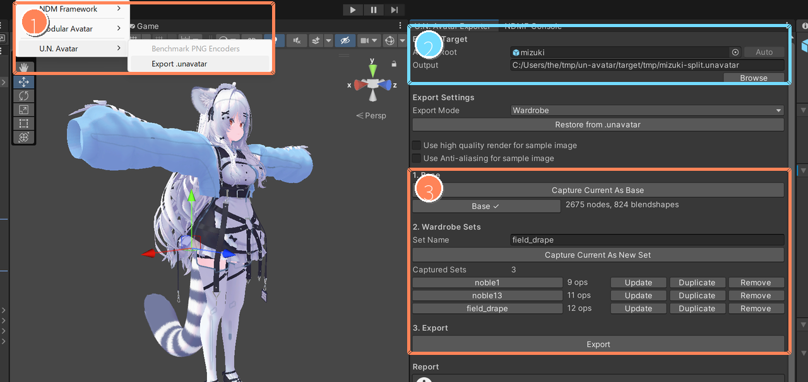
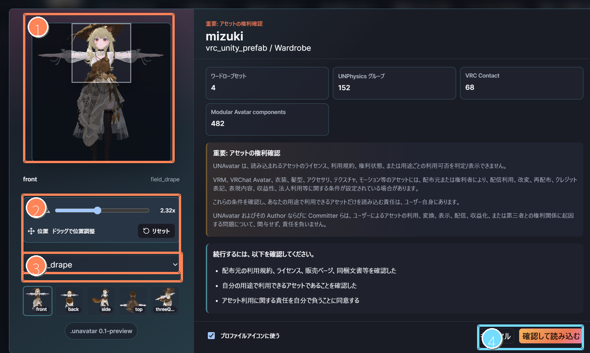
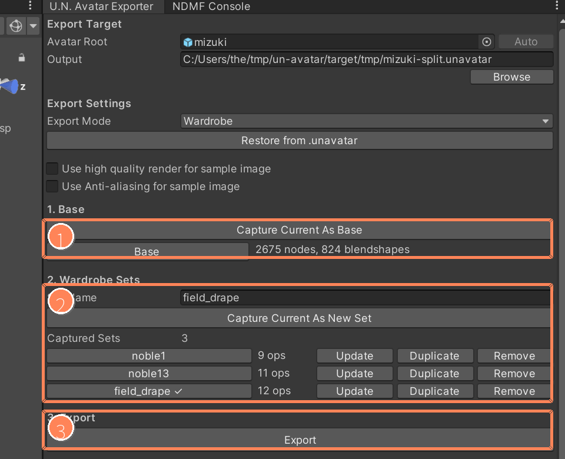
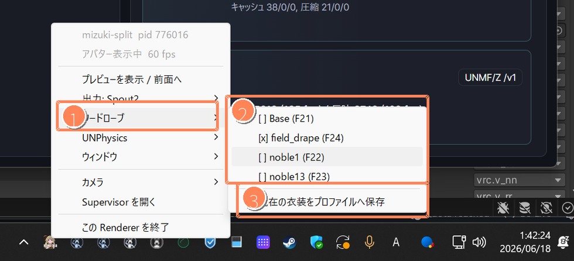
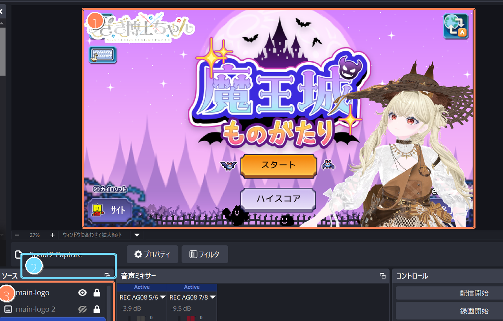

# U.N. Avatar v2 Getting Started

この文書は、U.N. Avatar v2 を初めて使う人向けの手順です。
概要は `README.md`、ここでは実際の操作を説明します。

## まず知っておくこと

U.N. Avatar は、アバターを単体 Renderer で表示し、Window Preview や Spout2 で配信ソフトへ出力します。

- VRM は、そのまま Supervisor のプロファイルへ登録して使います。
- VRC / Unity アバターは、Unity Editor の U.N. Avatar Exporter で `.unavatar` にしてから使います。
- `.unavatar` は、VRC / Unity アバターを U.N. Avatar で使うための配信用アバターパッケージです。
- Wardrobe は、衣装・小物・見た目プリセットを `.unavatar` に保存し、Renderer 起動後に切り替える機能です。

```text
VRC / Unity avatar in Unity
  -> U.N. Avatar Exporter
  -> .unavatar
  -> U.N. Avatar Supervisor / Renderer
  -> Window / Spout2
  -> OBS or streaming software
```

U.N. Avatar Renderer は、実行時に Unity Editor や VRChat client を必要としません。

## VRM を使う

1. `un-avatar-supervisor.exe` を起動します。
2. 左側メニューから `プロファイル` を開きます。
3. `+` ボタンで新しいプロファイルを作ります。
4. アバターファイルとして `.vrm` を選びます。
5. モーション入力、出力、ウィンドウ、カメラなどを必要に応じて設定します。
6. `起動` ボタンで Renderer を起動します。
7. U.N. Motion や VMC 対応アプリから UNMF/Z または VMC/UDP でモーションを送ります。

## VRC / Unity アバターを使う

VRC / Unity アバターは、先に Unity Editor で `.unavatar` を作ります。

### 1. Exporter を導入する

推奨手順:

- [Add to VCC](vcc://vpm/addRepo?url=https%3A%2F%2Fusagi.github.io%2Fun-avatar%2Fvcc%2Findex.json) を開いて repository を追加します。

リンクで開けない場合は、VRChat Creator Companion (VCC) の `Settings > Packages > Add Repository` に次の URL を追加します。

```text
https://usagi.github.io/un-avatar/vcc/index.json
```

- 追加後、対象 project の Package Manager で `U.N. Avatar Unity Exporter` を探してインストールします。

他の方法:

- Unity Editor の `Window > Package Manager` で `Add package from git URL` を選び、`https://github.com/usagi/un-avatar.git?path=/unity/un-avatar-unity-exporter` を入力してインストールします。
- Unity Editor の `Window > Package Manager` で `Add package from disk` を選び、U.N. Avatar 配布パッケージの `unity/un-avatar-unity-exporter/package.json` を指定してインストールします。

### 2. `.unavatar` を出力する

1. Unity Editor で `Tools > U.N. Avatar > Export .unavatar` を開きます。
2. `Avatar Root` に Hierarchy からアバターのルート GameObject を指定します。
3. `Output` に `.unavatar` を出力するパスを設定します。
4. 操作パネルの `1. Base -> 2. Wardrobe Sets -> 3. Export` の順に操作します。



> 図1:
>
> - 1: `Tools > U.N. Avatar > Export .unavatar` から Exporter を開きます。
> - 2: `Avatar Root` と `Output` を指定します。
> - 3: `Base`、`Wardrobe Sets`、`Export` の順に操作します。

Wardrobe を使わない場合は、Export Mode を `Current to Base Only` にして `3. Export` へ進みます。

Wardrobe を使う場合は、Export Mode を `Wardrobe` にして、`1. Base` と `2. Wardrobe Sets` で衣装や小物などの状態を保存してから `3. Export` で出力します。

### 3. Supervisor で起動する

1. `un-avatar-supervisor.exe` を起動します。
2. 左側メニューから `プロファイル` を開きます。
3. `+` ボタンで新しいプロファイルを作ります。
4. アバターファイルとして出力した `.unavatar` を選びます。
5. 必要に応じて出力モード、カメラ、モーション入力を設定します。
6. `起動` ボタンで Renderer を起動します。



> 図2:
>
> - 1: プロファイルアイコンに使う切り抜き範囲です。
> - 2: ズームと位置を調整します。
> - 3: プレビューする Wardrobe set を選びます。
> - 4: 権利確認を読んだうえで `.unavatar` を読み込みます。

## Wardrobe を使う

Wardrobe を使うと、Renderer を起動したまま衣装や小物の状態を切り替えられます。

### Base を保存する

`Base` は、お着替え元にする基本状態です。

1. 素体や基本衣装など、最初の状態にしたい GameObject を有効にします。
2. 不要な衣装や小物は Inspector の GameObject active toggle で無効にします。
3. `Capture Current As Base` で状態を保存します。

変更したくなったら、同じボタンで再度保存できます。

### Wardrobe Sets を保存する

`Sets` は、お着替えバリエーションです。

1. 衣装や小物の GameObject active state を切り替えます。
2. 必要に応じて素体側の衣装や blendshape を調整します。
3. `Capture Current As Set` で状態を保存します。



> 図3:
>
> - 1: 現在の Unity scene 状態を `Base` として保存します。
> - 2: 衣装や小物の状態を `Wardrobe Sets` として保存・更新します。
> - 3: 保存した Base / Sets を含む `.unavatar` を出力します。

保存済み set は、必要に応じて `Update`、`Duplicate`、`Remove` できます。Set は複数作れます。

Base / Sets の名称ボタン部分をクリックすると、Unity scene のアバター状態を保存済み状態へ切り替えられます。

### Modular Avatar 対応衣装の例

素体に Modular Avatar 対応衣装をぶら下げた Hierarchy では、次のような流れで設定できます。

1. 素体のみ有効、追加衣装は無効の状態で Base を保存します。
2. 追加衣装を有効にします。
3. 素体側の不要な衣装を無効にします。
4. 必要に応じて blendshape で素体の状態を調整します。
5. その状態を Set として保存します。
6. 別の衣装や小物の状態を作り、さらに Set として保存します。

Modular Avatar 非対応の衣装でも、GameObject active state を使って同じように Wardrobe set として扱えます。

Renderer 起動後は、Windows tray の Renderer メニューから Wardrobe を切り替えられます。`現在の衣装をプロファイルへ保存` を使うと、次回起動時の既定 Wardrobe set として保存できます。



> 図4:
>
> - 1: Renderer tray から `ワードローブ` メニューを開きます。
> - 2: 配信中に切り替える Wardrobe set を選びます。
> - 3: 現在の衣装を次回起動時の既定値としてプロファイルへ保存します。

## モーション入力

Renderer 起動後、U.N. Motion から UNMF/Z を送ると表情、姿勢、手足などを動かせます。

U.N. Motion なしでも、VMC/UDP を送信できる既存アプリを使えます。用途に合わせて Supervisor のプロファイルで入力方式を設定してください。

## 日常運用

Supervisor は、プロファイルの作成、設定、確認、ショートカット作成を行う管理画面です。Renderer は、配信時にアバターを表示して Window Preview や Spout2 へ出力する単体プロセスです。

設定が固まったプロファイルは、Supervisor を毎回開かずにショートカットやピン留めから直接 Renderer として起動できます。配信前の確認や設定変更が必要なときは、Supervisor に戻ってプロファイルを編集します。

Renderer 単独起動中の操作は、Windows タスクトレイの Renderer アイコンを右クリックして行います。Tray メニューから Wardrobe、出力モード、ウィンドウ、カメラ、Supervisor を開く、Renderer の終了などを操作できます。

## OBS / Spout2 出力

Spout2 を使う場合は、Renderer の出力モードを `Spout2 + Preview` または `Spout2 Only (HIDE)` にします。OBS 側では Spout2 Capture source を追加して、U.N. Avatar の Spout2 sender を選びます。背景を透過したい場合は、Spout2 Capture の `Composite mode` を `Premultiplied Alpha` にします。



> 図5:
>
> - 1: OBS preview に入った U.N. Avatar の Spout2 出力です。
> - 2: `Spout2 Capture` source を選択しています。
> - 3: source 一覧で Spout2 Capture を管理します。

<video src="assets/v2-getting-started/wardrobe-switch-demo.webm" controls muted playsinline width="960"></video>

動画が表示されない場合は、[wardrobe-switch-demo.webm](assets/v2-getting-started/wardrobe-switch-demo.webm) または [wardrobe-switch-demo.mp4](assets/v2-getting-started/wardrobe-switch-demo.mp4) を直接開いてください。

## 困ったとき

- Renderer が起動しない場合は、Supervisor のプロファイルでアバターファイルと出力設定を確認します。
- VRC / Unity アバターが読み込めない場合は、Unity Editor で `.unavatar` を出力し直します。
- Wardrobe が期待通りに切り替わらない場合は、Unity Editor で `Base` と `Wardrobe Sets` を保存し直してから再度エクスポートします。
- Spout2 が見えない場合は、Renderer の出力モードが `Spout2 + Preview` または `Spout2 Only (HIDE)` になっているか確認します。

## `.unavatar` の扱い

`.unavatar` には、avatar mesh、texture、material metadata、lilToon parameters、PhysBone 由来 dynamics、Expression Menu / Animator 由来 action、Wardrobe set などが含まれます。

第三者への共有や配布は、必ず元アバター、衣装、テクスチャ等の利用規約に従ってください。U.N. Avatar は、ユーザー自身が正規に利用できるアセットをローカル環境で配信等に利用することを主目的とします。

## 図・動画で使用した素材

この文書の図と動画には、U.N. Avatar の操作例として次の素材を使用しています。各素材の権利はそれぞれの権利者に帰属します。

- アバターモデル: [オリジナル3Dモデル「瑞希」メニューギミック搭載](https://booth.pm/ja/items/5132797) / IKUSIA
- 衣装: [Noble Trace - Classic](https://booth.pm/ja/items/6786314) / VELLIE
- 衣装: [Field Drape](https://booth.pm/ja/items/8362173) / CYCR (Cyber Critter)
- ゲーム画面: [魔王城ものがたり](https://store.steampowered.com/app/4212210/Demon_Castle_Story/?l=japanese) / (C) KAIROSOFT CO.,LTD. All Rights Reserved.
